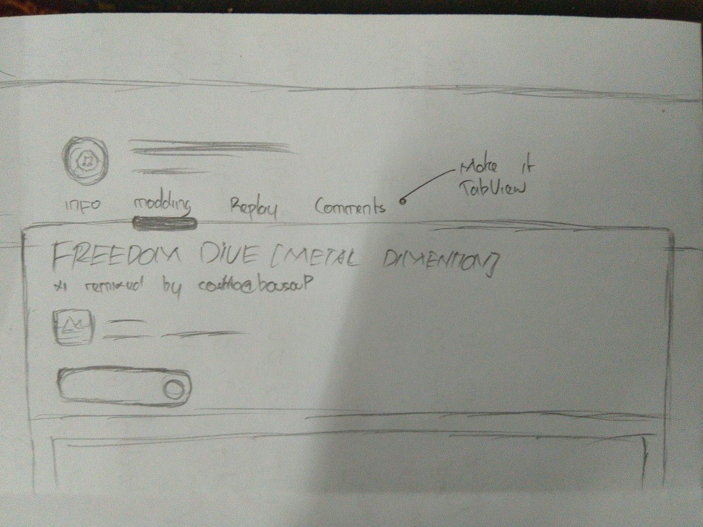
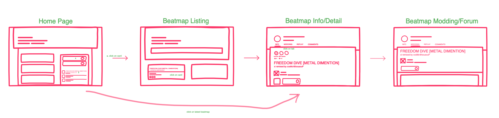

# Sketching and Prototyping
## Part A: Sketches
### 1. Scan/Photo of Sketches
```
I hope the texts is readable enough
```




### 2. Version Differences

#### Current Version

Right now, we can go back to beatmap page from beatmap modding discussion by clicking the beatmap name/title. But that's not obvious to user that it bring us back, in fact, it's not even obvious clickable in a glimpse.

#### Sketch 1

It's very obvious that button is something that really intended to be clicked. So that's why I placed the button below the other existing button (stacked view) so user can see them like **action center**

Design reference: https://osu.ppy.sh/beatmapsets/905158#osu/1889232

#### Sketch 2

**Breadcrumb** make navigation between stacked page easier, since we can navigate to their "parent" page or maybe their "grandparent" page.

Design reference: https://osu.ppy.sh/community/forums/2

#### Sketch 3

Since it's on the same context (beatmap page), so I think it's make sense to place it on same page both the beatmap info, discussion forum, and other relevant page then separate them into **tab view**.

Design reference: https://osu.ppy.sh/users/5011137

### 3. Selected Sketch

I'll go to the **third sketch/option** based on:

1. It's more reasonable to use tab view cause on the same context between other related pages.
2. Based on latest official design language for tab view
3. It also make user easier for navigate through other pages, not only to beatmap info and discussion.

### 4. Design Rationale
Based on my assumption and my knowledge on contextual inquiry, user should be able to navigate through related pages easily. Right now, based on my testing and interview on last assignment, it show that user not clearly know what should they do or what should they click to navigate between related pages. Actually all of my sketches answer that problem, but back to what I said in *Selected Sketch*, I prefer to choose the third one. 

## Part B: Assumptions
### 1. Hardware
1. Every PC/laptops with at least 1:1 or 4:3 screen ratio
2. Can be mouse + keyboard user or touchscreen user

### 2. Users
1. Of course osu! player 
2. Really know what's osu! related context and glossarium
3. Familiar with old page or new page design
4. Specifically Mappers, QAT, or Beatmap Nominator (player who create beatmap, beatmap quality assurance, and beatmap nominator/checker) who use this page more often then rest of the players

## Part C: Prototypes



Freehand link: https://projects.invisionapp.com/freehand/document/cXj02sDEu

Low-fidelity prototype link: https://invis.io/9KR79VM2HGV

High-fidelity prototype link: https://invis.io/Q4RCSR22TUJ